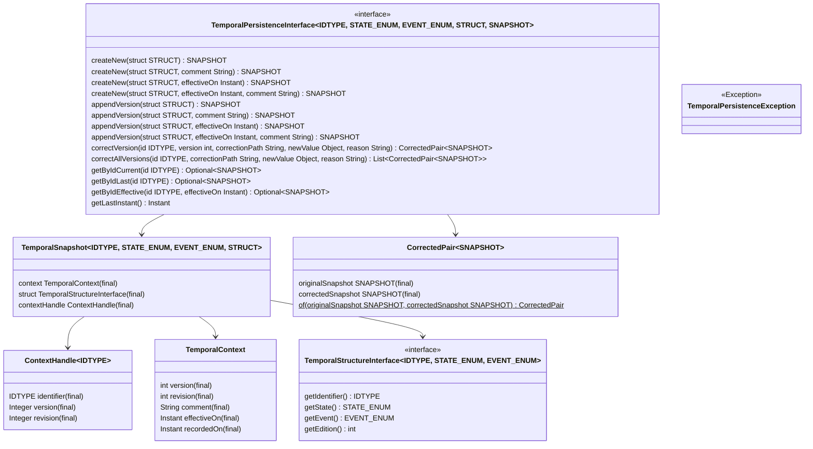

# Bi-Temporal Data Base Library

This library provides the foundation elements of the broader bi-temporal persistence libraries.

## Class Structure

```mermaid
classDiagram
    
    class TemporalContext {
        int version (final)
        int revision (final)
        String comment (final)
        Instant effectiveOn (final)
        Instant recordedOn (final)
    }

    class ContextHandle~IDTYPE~ {
        IDTYPE identifier (final)
        Integer version (final)
        Integer revision (final)
    }

    class TemporalStructureInterface~IDTYPE, STATE_ENUM, EVENT_ENUM~ {
        <<interface>>
        getIdentifier() IDTYPE
        getState() STATE_ENUM
        getEvent() EVENT_ENUM
        getEdition() int
    }

    class TemporalSnapshot~IDTYPE, STATE_ENUM, EVENT_ENUM, STRUCT~ {
        context TemporalContext (final)
        struct TemporalStructureInterface (final)
        contextHandle ContextHandle (final)
    }

    TemporalSnapshot --> ContextHandle
    TemporalSnapshot --> TemporalContext
    TemporalSnapshot --> TemporalStructureInterface
    
    class CorrectedPair~SNAPSHOT~ {
			originalSnapshot SNAPSHOT (final)
			correctedSnapshot SNAPSHOT (final)

			of(originalSnapshot SNAPSHOT, correctedSnapshot SNAPSHOT) CorrectedPair $
    }

    class TemporalPersistenceInterface~IDTYPE, STATE_ENUM, EVENT_ENUM, STRUCT, SNAPSHOT~ {
        <<interface>>

        createNew(struct STRUCT) SNAPSHOT
        createNew(struct STRUCT, comment String) SNAPSHOT
        createNew(struct STRUCT, effectiveOn Instant) SNAPSHOT
        createNew(struct STRUCT, effectiveOn Instant, comment String) SNAPSHOT
        
        appendVersion(struct STRUCT) SNAPSHOT
        appendVersion(struct STRUCT, comment String) SNAPSHOT
        appendVersion(struct STRUCT, effectiveOn Instant) SNAPSHOT
        appendVersion(struct STRUCT, effectiveOn Instant, comment String) SNAPSHOT
        
        correctVersion(id IDTYPE, version int, correctionPath String, newValue Object, reason String) CorrectedPair~SNAPSHOT~
        correctAllVersions(id IDTYPE, correctionPath String, newValue Object, reason String) List~CorrectedPair~SNAPSHOT~~
        
        getByIdCurrent(id IDTYPE) Optional~SNAPSHOT~
        getByIdLast(id IDTYPE) Optional~SNAPSHOT~
        getByIdEffective(id IDTYPE, effectiveOn Instant) Optional~SNAPSHOT~
        
        getLastInstant() Instant
    }

    TemporalPersistenceInterface --> TemporalSnapshot
    TemporalPersistenceInterface --> CorrectedPair
    
    class TemporalPersistenceException {
    	<<Exception>>
    }

```